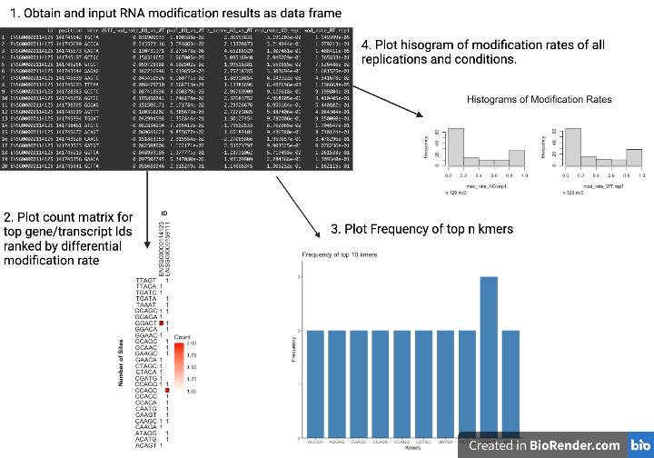

<!-- README.md is generated from README.Rmd. Please edit that file -->

# NanoPlotR

<!-- badges: start -->
<!-- badges: end -->

The purpose of NanoPlotR is to allow visual interpretation of results
from nanopore sequencing based RNA modification detection tools such as
xPore (Pratanwanich et al., 2021). NanoPlotR enables fast and convenient
plotting of RNA modification detection results for
visualization/interpretation of the results.

NanoPlotR is unique from other R packages as there does not exist a R
package that allows fast/convenient plotting of nanopore sequencing
based RNA modification detection results. The package will allow
researchers running a nanopore based RNA modification analysis (using
xPore or etc.) to quickly visualize the results using the available
plotting functions.

Note that currently NanoPlotR assumes modification results formatted
according to the xPore (Pratanwanich et al., 2021) output format. Thus,
the NanoPlotR works best with RNA modification analysis pipelines that
utilize xPore. Support for other output formats may be included in the
future. Results from other detection tools must be transformed into the
xPore output format unless further support for other formats are
released.

NanoplotR was developed in R 4.1.0 and on a Mac platform.

## Installation

You can install the development version of NanoPlotR like so:

``` r
require("devtools")
devtools::install_github("daewon-gong/NanoPlotR", build_vignettes = TRUE)
library("NanoPlotR")

To run the shinyApp:
Under construction
```

## Overview

``` r
ls("package:NanoPlotR")
data(package = "NanoPlotR") # optional
```

There are **4** functions that are available for user access:

**1. plotCountMatrix** allows users to plot a count matrix of top
transcript/gene ids ranked by differencial modification rates. Users
have the option to choose which kmers to include from the modSites
parameter along with how many transcript/gene ids to include from the
numTopIds parameter. The function will output a ggplot.

**2. plotTopKmers** allows users to plot a bar graph with the top kmers
ranked by frequency. Users have the option to choose how many top kmers
to plot through the numKmers parameter. The function will output a
ggplot.

**3. plotModHist** allows users to plot histograms to show distribution
of modification rates of all replication/conditions.

**3. getTopIds** allows users to retrieve the top gene/transcript ids
ranked by differential modification rates. The function outputs a string
vector of the top gene/transcript ids.

For more details about the functions, please take a look at the vignette
for this package:

``` r
browseVignettes("NanoPlotR")
```

An overview of the package is illustrated below:


The package tree structure follows:

``` r
- microCompet
  |- NanoPlotR.Rproj
  |- DESCRIPTION
  |- NAMESPACE
  |- LICENSE
  |- README
  |- data
    |- RnaModificationResults.rda
  |- inst
    |- extdata
      |- NanoPlotROverview.png
  |- man
    |- getTopIds.Rd
    |- plotCountMatrix.Rd
    |- plotTopKmers.Rd
    |- plotModHist.Rd
    |- RnaModificationResults.Rd
  |- R
    |- plotModificationResults.R
    |- data.R
  |- tests
    |- testthat.R
    |- testthat
      |- test-getTopIdsR
      |- test-plotCountMatrix.R
      |- test-plotTopKmers.R
      |- test-plotModHist.R
  |- Vignette
    |- NanoPlotRVignette.Rmd
    |- countMatrix.png
    |- kmerFreq.png
    |- modHist.png
```

## Contributions

The author of this package is Dae-won Gong.

For functions **plotCountMatrix**, **plotTopKmers** and **getTopIds**
the **dplyr** and **magrittr** packages for data processing. The
**ggplot2** package is used for plotting in the **plotCountMatrix** and
**plotTopKmers** functions, while the **Hmisc** package is used for
plotting in **plotModHist**.

## References

Frank E Harrell Jr (2021). Hsmisc: Harrell Miscellaneous. R package
version 4.6.0. <https://CRAN.R-project.org/package=Hmisc>

Hadley Wickham, Romain François, Lionel Henry and Kirill Müller (2021).
dplyr: A Grammar of Data Manipulation. R package version 1.0.7.
<https://CRAN.R-project.org/package=dplyr>

H. Wickham. ggplot2: Elegant Graphics for Data Analysis. Springer-Verlag
New York, 2016.

Pratanwanich, P. N., Yao, F., Chen, Y., Koh, C. W. Q., Wan, Y. K.,
Hendra, C., Poon, P., Goh, Y. T., Yap, P. M. L., Chooi, J. Y., Chng, W.
J., Ng, S. B., Thiery, A., Goh, W. S. S., & Göke, J. (2021).
Identification of differential RNA modifications from nanopore direct
RNA sequencing with xPore. Nature Biotechnology, 39(11), 1394–1402.
<https://doi.org/10.1038/s41587-021-00949-w>

R Core Team (2021). R: A language and environment for statistical
computing. *R Foundation for Statistical Computing*, Vienna, Austria.
URL <https://www.R-project.org/>.

Wickham, H. and Bryan, J. (2019). R Packages (2nd edition). Newton,
Massachusetts: O’Reilly Media. <https://r-pkgs.org/>

## Acknowledgements

This package was developed as part of an assessment for 2021 BCB410H:
Applied Bioinformatics, University of Toronto, Toronto, CANADA.
