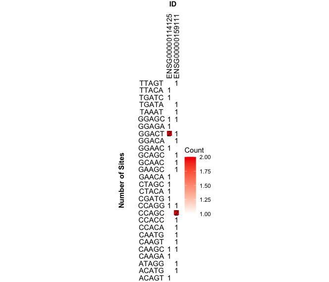
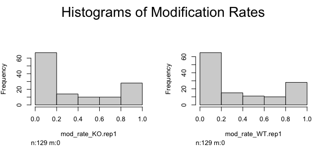

## Introduction

*NanoPlotR* is an R package that allows visualization of results from nanopore sequencing based RNA modification detection tools such as xPore (Pratanwanich et al., 2021). NanoPlotR enables fast and convenient plotting of RNA modification detection results for visualization/interpretation of the results.

One common input required for all functions is the modResults param which you will see later in the components section. The modResults param is a data frame of the RNA modification results from detection tools. It is currently required to follow the result format of xPore as NanoPlotR only supports xPore's output format. However, NanoPlotR is still usable with results from other detection tools if results are transformed to follow xPore's output format: https://xpore.readthedocs.io/en/latest/outputtable.html. 

To download **NanoPlotR**, use the following commands:

```{r eval=FALSE}
require("devtools")
devtools::install_github("daewon-gong/NanoPlotR", build_vignettes = TRUE)
library("NanoPlotR")
```

To list all functions available in NanoPlotR:

```{r eval=FALSE}
ls("package:NanoPlotR")
```

To list sample dataset in this package:

```{r eval=FALSE}
data(package = "NanoPlotR")
```

<br>

## Components

Details of the 4 functions availble:

### 1. plotTopKmers

***plotTopKmers*** plots a ggplot bargraph of n top kmers. Users choose how many kmers to plot through specifying the "numTopKmers" parameter which is defaulted to 20.

``` {r eval=FALSE}
NanoPlotR::plotTopKmers(RnaModificationResults, numKmers = 10)
```

### 2. plotCountMatrix

***plotCountMatrix*** plots a count matrix of top gene/transcript Ids of selected modSites. Top gene/transcript Ids are ranked by differential modification rate. Users are able to select which kmers to include through the modSites parameter when provided the function only plots kmers that have the characters specified in modSites in the middle (ex. if modSites = c("A"), only plot kmers that have "A" in the middle such as "GCATC"). The numTopIds parameter allows users to specify how many Ids to plot. 

``` {r eval=FALSE}
NanoPlotR::plotCountMatrix(RnaModificationResults, modSites = c("A"), numTopIds = 2)
```



### 3. plotModHist

**plotModHist** plots histograms to show distribution of modification rates of all replication and conditions. 

``` {r eval=FALSE}
NanoPlotR::plotModHist(RnaModificationResults)
```



### 4. getTopIds

**getTopIds** retrieves the top gene/transcript ids ranked by differential modification rates. The function outputs a string vector of the top gene/transcript ids. Users can specify how many Ids to return through the numTopIds parameter.

``` {r eval=FALSE}
NanoPlotR::getTopIds(RnaModificationResults, numTopIds = 1)
```

<br>

## References

Frank E Harrell Jr (2021). Hsmisc: Harrell Miscellaneous. R package version 4.6.0. https://CRAN.R-project.org/package=Hmisc

Hadley Wickham, Romain François, Lionel Henry and Kirill Müller (2021). dplyr: A Grammar of
Data Manipulation. R package version 1.0.7. https://CRAN.R-project.org/package=dplyr
  
H. Wickham. ggplot2: Elegant Graphics for Data Analysis. Springer-Verlag New York, 2016.

Pratanwanich, P. N., Yao, F., Chen, Y., Koh, C. W. Q., Wan, Y. K., Hendra, C., Poon, P., Goh, Y. T., Yap, P. M. L., Chooi, J. Y., Chng, W. J., Ng, S. B., Thiery, A., Goh, W. S. S., & Göke, J. (2021). Identification of differential RNA modifications from nanopore direct RNA sequencing with xPore. Nature Biotechnology, 39(11), 1394–1402. https://doi.org/10.1038/s41587-021-00949-w

R Core Team (2019). R: A language and environment for statistical computing. *R Foundation for Statistical Computing*, Vienna, Austria. URL https://www.R-project.org/.

Wickham, H. and Bryan, J. (2019). R Packages (2nd edition). Newton, Massachusetts: O’Reilly Media. https://r-pkgs.org/

----

```{r}
sessionInfo()
```
